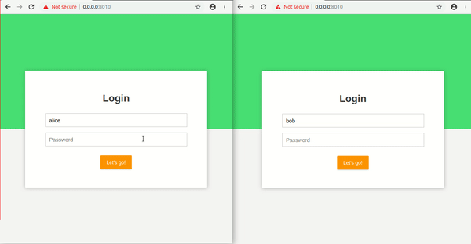

## Message Asynch Server (on Spring Boot WebSocket STOMP)



Run server directly

```bash
cd server/
mvn spring-boot:run
```

Run using docker-compose:

```bash
docker-compose up
```

TODO:
- Authorisation
- Members management page
- File transmition
- Stream transmition
- Any language clients (Java, Python, JS...)

## Learn More

You can find the tutorial for sample application on this blog -
https://www.callicoder.com/spring-boot-websocket-chat-example/
